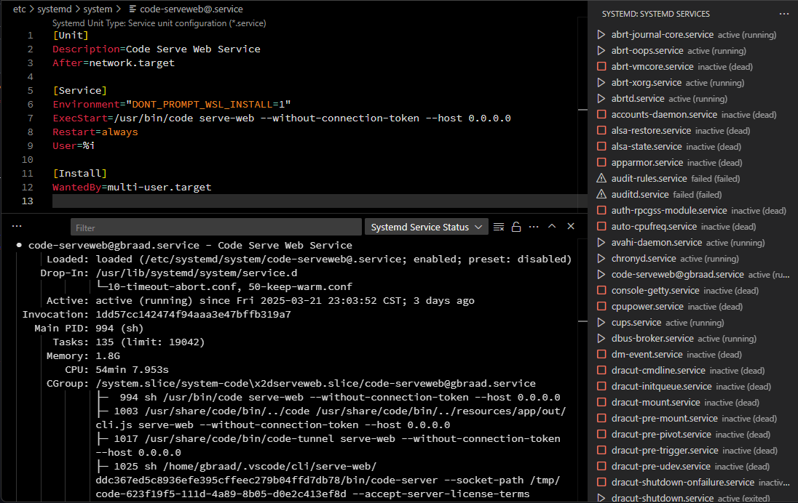

systemd Universal Manager for VS Code
=====================================

systemd Manager is a Visual Studio Code extension designed to help users manage and maintain the state of systemd services and units on their host systems. This extension provides a user-friendly interface to interact with systemd, allowing for easy management of services and units directly from the VSCode environment.

Authors
-------

|  |
|---|
| [@gbraad](https://gbraad.nl/social)  |

